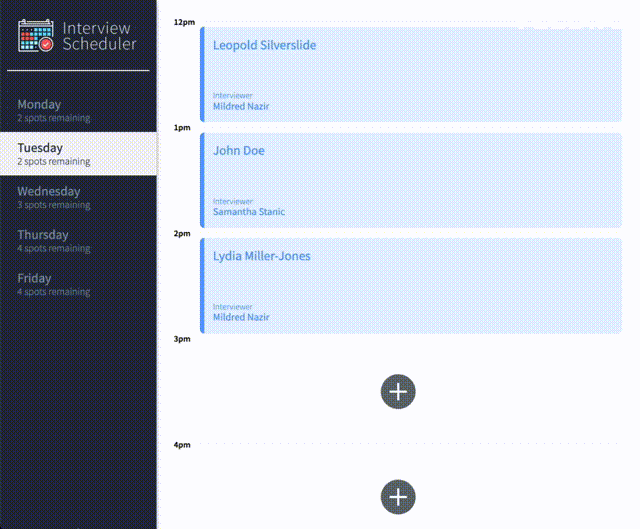
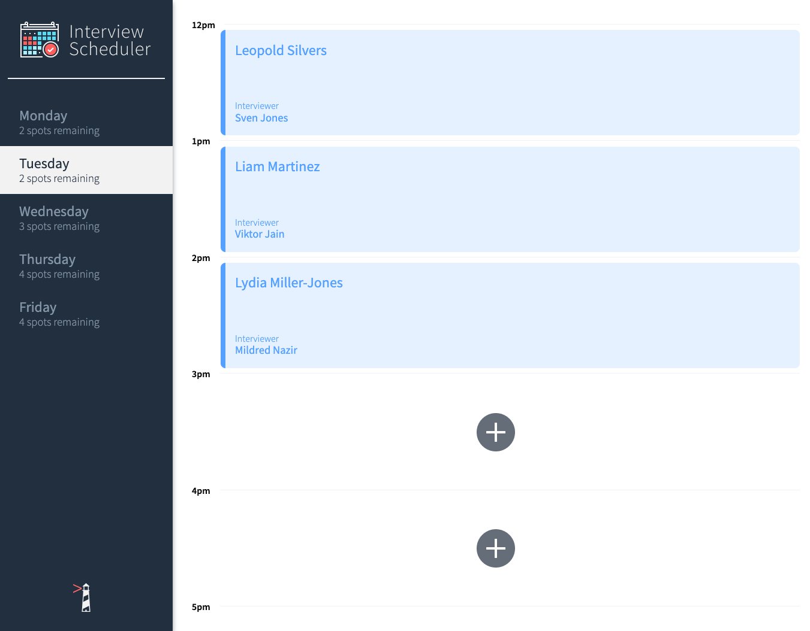

# Interview Scheduler Project

Interview Scheduler is a React-based application that allows users to schedule technical interviews between students and mentors. The app limits appointments to weekdays between 12 PM and 5 PM and allows users to view, create, edit, and delete appointments using a predefined list of interviewers.

## Purpose

The goal of this project is to develop and test a real-time React application by utilizing modern tools and techniques along with a concise API and WebSocket server.

## Gallery

|  | 
|:--:| 
| App Walkthrough |

|  | 
|:--:| 
| Interview Scheduler |

## Getting Started

- Install all dependencies with `npm install`
- Fork and clone the scheduler-api <https://github.com/lighthouse-labs/scheduler-api> into a new directory. Follow the README.md instructions to complete the installation.
- Add "proxy": "http://localhost:8001" to the package.json file in our main scheduler (React App) directory
- Run the Webpack Development Server in our main scheduler (React App) directory with `npm start`.
- Run the API server from the scheduler-api directory with `npm start`. The API server will run in localhost PORT:8001
- Open your browser and navigate to <http://localhost:8000/>

## Running API server in TEST_ERROR environment

```sh
npm run error
```

## Running Jest Test Framework

```sh
npm test
```

## Running Storybook Visual Testbed

```sh
npm run storybook
```

## Dependencies

- npm @ 8.0.0
- node @ 16.0.0
- axios @ 0.20.0
- classnames @ 2.2.6
- normalize.css @ 8.0.1
- react @ 16.9.0
- react-dom @16.9.0
- react-scripts @ 3.4.4

## Footnote

This project was created and published by [Jerome Lagbas](https://github.com/jeromealmir) as part of the Web Development program at Lighthouse Labs.
